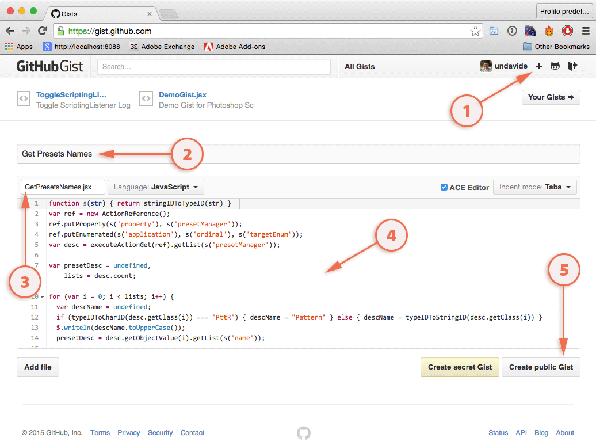
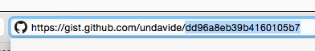

Clone this recipe and use it as a reference to build your own.

## Problem
Describe briefly here the problem your recipe is trying to solve.

Each recipe is a markdown file, please refer to this [Markdown basics](https://help.github.com/articles/markdown-basics/) reference, and find also why the [GitHub Flavoured Markdown](https://help.github.com/articles/github-flavored-markdown/) is different from the standard one.

## Solution
Here the recipe code is exposed.

We enforce the use of [Gist](https://gist.github.com/) for code snippets that are meant to be downloaded and used directly.

> Gist is a simple way to share snippets and pastes with others. All gists are Git repositories, so they are automatically versioned, forkable and usable from Git.

An actual, embedded Gist look like this:



It is quite simple to create and embed one. Go to the [Gist](https://gist.github.com/) webpage and login with your GitHub credentials. Then click on the **plus** icon in the top-right corner to create a new Gist and start filling the required fields.

Type in a short description, give the snipped a meaningful name then click the **Create public Gist** button in the bottom-right corner.

{: .shadow-z-2 .img-responsive}

In order to embed in in your recipe, copy the Gist ID in the URL bar of your browser:

{: .shadow-z-2}

and paste it in the markdown this way:

	
	
	

The Gist will be embedded as we did up above in this very page.

Conversely, for **supporting code** you might want to write inline you may not bother with Gists and just use the following syntax:

	
	
	var myWindow = new Window("dialog");
	var myMessage = myWindow.add("statictext");
	myMessage.text = "Hello, world!";
	myWindow.show();
	
	
 
which will be parsed into a properly syntax highlighted text block:


var myWindow = new Window("dialog");
var myMessage = myWindow.add("statictext");
myMessage.text = "Hello, world!";
myWindow.show();


## Discussion
Here goes the explanation about the reason why this recipe solves the initial problem.

Also, chunks of discussions quoted from the forums might add the needed context and provide historic information about the evolution of the techniques described.

## References
This section contains extra information such as:

- Link to the Forums discussion
- Credits for the snippets 
- Photoshop versions covered
